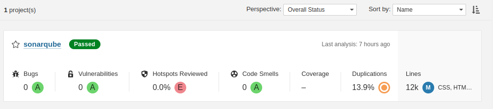

# CloudCruise CI/CD Pipeline Solution

## Table of Contents
1. [Introduction](#introduction)
2. [Architecture Overview](#architecture-overview)
3. [Features](#features)
4. [Prerequisites](#prerequisites)
5. [Setup Instructions](#setup-instructions)
6. [Usage](#usage)
7. [Monitoring and Security](#monitoring-and-security)
8. [Contributing](#contributing)
9. [License](#license)

## Introduction

CloudCruise is a unified CI/CD pipeline solution aimed at simplifying the development and deployment workflows for your applications. It integrates seamlessly with popular tools like Jenkins, SonarQube, OWASP Dependency Check, and GitHub, leveraging the power of Google Cloud Platform (GCP) for robust infrastructure and scalability.

## Architecture Overview


CloudCruise architecture is built on GCP's Compute Engine service, providing scalable compute resources for your CI/CD needs. Jenkins serves as the central orchestration hub, managing the build, test, and deployment processes. SonarQube ensures code quality and security with advanced static code analysis, while OWASP Dependency Check identifies and mitigates security vulnerabilities in your dependencies.

GitHub webhooks trigger CI/CD pipelines upon code commits, initiating automated builds and deployments. Docker containers are utilized for application packaging and deployment, ensuring consistency across environments. HTML/CSS/JS are employed for the company website, seamlessly integrated into the CI/CD workflow.

## Features

- **End-to-End Automation:** Automate the entire CI/CD pipeline from code commit to deployment, reducing manual intervention and human error.
- **Scalable Infrastructure:** Leverage GCP Compute Engine for scalable and reliable compute resources, accommodating varying workloads.
- **Code Quality Assurance:** Utilize SonarQube for advanced static code analysis, ensuring code quality and adherence to best practices.
- **Security Monitoring:** OWASP Dependency Check identifies and mitigates security vulnerabilities in project dependencies, enhancing overall application security.
- **GitHub Integration:** Seamlessly integrate with GitHub repositories using webhooks, triggering automated builds and deployments upon code changes.
- **Dockerization:** Package applications into Docker containers for consistent deployment across different environments.
- **Email Notifications:** Receive email notifications for build and deployment statuses, keeping stakeholders informed throughout the process.
- **Web UI Testing:** Incorporate automated testing of the company website to ensure functionality and compatibility across browsers.

## Prerequisites

Before setting up CloudCruise, ensure you have the following prerequisites:

- Access to a Google Cloud Platform account with permissions to create Compute Engine instances.
- Jenkins installed and configured on a virtual machine within your GCP environment.
- SonarQube server deployed for code analysis.
- OWASP Dependency Check integrated into your CI/CD pipeline.
- Docker installed on your Jenkins server for containerization.
- A GitHub repository hosting your application code.
- Basic knowledge of HTML/CSS/JS for website development.

## Setup Instructions

Follow these steps to set up CloudCruise:

* compute engine (VM configurations and installation):

## Terraform script

``` hcl
# This code is compatible with Terraform 4.25.0 and versions that are backward compatible to 4.25.0.
# For information about validating this Terraform code, see https://developer.hashicorp.com/terraform/tutorials/gcp-get-started/google-cloud-platform-build#format-and-validate-the-configuration

resource "google_compute_instance" "iac-project-cicd-server" {
  boot_disk {
    auto_delete = true
    device_name = "iac-project-cicd-server"

    initialize_params {
      image = "projects/debian-cloud/global/images/debian-12-bookworm-v20240415"
      size  = 10
      type  = "pd-balanced"
    }

    mode = "READ_WRITE"
  }

  can_ip_forward      = false
  deletion_protection = false
  enable_display      = false

  labels = {
    goog-ec-src = "vm_add-tf"
  }

  machine_type = "n2-standard-4"
  name         = "iac-project-cicd-server"

  network_interface {
    access_config {
      network_tier = "PREMIUM"
    }

    queue_count = 0
    stack_type  = "IPV4_ONLY"
    subnetwork  = "projects/simple-website-421905/regions/asia-south1/subnetworks/default"
  }

  scheduling {
    automatic_restart   = true
    on_host_maintenance = "MIGRATE"
    preemptible         = false
    provisioning_model  = "STANDARD"
  }

  service_account {
    email  = "209890922410-compute@developer.gserviceaccount.com"
    scopes = ["https://www.googleapis.com/auth/cloud-platform"]
  }

  shielded_instance_config {
    enable_integrity_monitoring = true
    enable_secure_boot          = false
    enable_vtpm                 = true
  }

  tags = ["http-server", "https-server"]
  zone = "asia-south1-c"
}

```

### installation of jenkins into server ,java11 and setup docker

```bash
sudo apt install openjdk-11-jre
sudo wget -O /usr/share/keyrings/jenkins-keyring.asc \
  https://pkg.jenkins.io/debian-stable/jenkins.io-2023.key
echo "deb [signed-by=/usr/share/keyrings/jenkins-keyring.asc]" \
  https://pkg.jenkins.io/debian-stable binary/ | sudo tee \
  /etc/apt/sources.list.d/jenkins.list > /dev/null
sudo apt-get update
sudo apt-get install jenkins

# Add Docker's official GPG key:
sudo apt-get update
sudo apt-get install ca-certificates curl
sudo install -m 0755 -d /etc/apt/keyrings
sudo curl -fsSL https://download.docker.com/linux/ubuntu/gpg -o /etc/apt/keyrings/docker.asc
sudo chmod a+r /etc/apt/keyrings/docker.asc

# Add the repository to Apt sources:
echo \
  "deb [arch=$(dpkg --print-architecture) signed-by=/etc/apt/keyrings/docker.asc] https://download.docker.com/linux/ubuntu \
  $(. /etc/os-release && echo "$VERSION_CODENAME") stable" | \
  sudo tee /etc/apt/sources.list.d/docker.list > /dev/null
sudo apt-get update

sudo apt-get install docker-ce docker-ce-cli containerd.io docker-buildx-plugin docker-compose-plugin

sudo groupadd docker
sudo usermod -aG docker $USER
newgrp docker

```
### setting up sonarqube with docker

```bash
docker run -d -p 9000:9000 sonarqube:lts-community
```
run jenkins :
  
  #### ip:8080 

run sonarqube :
  
  #### ip:9000

1. After setup Compute instance setup and configure Jenkins.
* setup username and account settings

2. Install and configure Jenkins with necessary plugins for CI/CD and write a pipeline.

- plugins :
    * sonarScanner
    * Docker Commons Plugin
    * Docker Compose Build Step Plugin
    * Docker Pipeline
    * GitHub Branch Source Plugi
    * SSH2 Easy Plugin
    * OWASP Dependency-Track Plugin
    * Email Extension Plugin

### jenkins groovy script for pipeline build sonarQube scanner and OWASP scanner With Docker build 


``` groovy
pipeline {
    agent any
    
    environment {
        SCANNER_HOME = tool 'sonarqube'
    }

    stages {
        stage('Github Checkout') {
            steps {
                // Checkout the source code from the repository
                checkout([$class: 'GitSCM',
                          branches: [[name: '*/main']],
                          userRemoteConfigs: [[url: 'https://github.com/tusuii/IAC_CICD_deployment.git']]])
            }
        }
        
        stage('SonarQube Scan') {
            steps {
                script {
                    sh "${SCANNER_HOME}/bin/sonar-scanner \
                        -Dsonar.projectKey=sonarqube \
                        -Dsonar.projectName=sonarqube \
                        -Dsonar.sources=. \
                        -Dsonar.java.binaries=. \
                        -Dsonar.host.url=http://35.202.14.231:9000/ \
                        -Dsonar.login=sqa_0cb1245b6826ead4c45dd4dbd030679d70404157"
                }
            }
        }
        
        stage('OWASP Scan') {
            steps {
                script {
                    // Perform OWASP Dependency Check
                    dependencyCheck additionalArguments: '''
                        -o './'
                        -s './'
                        -f 'ALL'
                        --prettyPrint''', odcInstallation: 'DP'
                    // Publish OWASP Dependency Check results
                    dependencyCheckPublisher pattern: 'dependency-check-report.xml'
                }
            }
        }
        
        
        stage('Build Docker Image') {
            steps {
                script {
                    // Check if Docker image exists
                    def imageExists = sh(script: "docker images -q webapp:latest", returnStatus: true) == 0
                    if (!imageExists) {
                        // Build Docker image if it doesn't exist
                        sh "docker build -t webapp ."
                        
                        
                    } else {
                        // Stop and remove existing Docker container
                        sh "docker stop app"
                        sh "docker rm app"
                        sh "docker build -t webapp ."
                    }
                }
            }
        }
        
        
        stage('Run Docker Application Container') {
            steps {
                // Run Docker container
                script {
                    sh "docker run -d -p 8070:80 --name app webapp"
                }
            }
        }
        stage('Trigger email notification') {
            steps {
                build job: "IAC CICD pipeline Email" , wait: true
            }
        }
    }
    
    post {
        success {
            echo 'Docker container is up and running.'
        }
        failure {
            echo 'Failed to build Docker image or run container.'
        }
    }
    
    triggers {
        githubPush()
    }
}


```

## jenkins groovy script for sending mail and reports

``` groovy
pipeline {
    agent any

    stages {
        stage('CD Pipeline started') {
            steps {
                echo 'CD pipeline'
            }
        }
        stage('Trivy Report generation') {
            steps {
                sh "trivy fs . --format table -o trivy-report.html"
            }
        }
        
    }
    post {
    always {
        script {
            def jobName = env.JOB_NAME
            def buildNumber = env.BUILD_NUMBER
            def pipelineStatus = currentBuild.result ?: 'UNKNOWN'
            def bannerColor = pipelineStatus.toUpperCase() == 'SUCCESS' ? 'green' : 'red'

            def body = """<html>
                          <body>
                          <div style="border: 4px solid ${bannerColor}; padding: 10px;">
                          <h2>${jobName} - Build ${buildNumber}</h2>
                          <div style="background-color: ${bannerColor}; padding: 10px;">
                          <h3 style="color: white;">Pipeline Status: ${pipelineStatus.toUpperCase()}</h3>
                          </div>
                          <p>Check the <a href="${BUILD_URL}">console output</a>.</p>
                          </div>
                          </body>
                          </html>"""
                          
            emailext (
                subject: "${jobName} - Build ${buildNumber} - ${pipelineStatus.toUpperCase()}",
                body: body,
                to: 'subodhkamble099@gmail.com',
                from: 'jenkins@example.com',
                replyTo: 'jenkins@example.com',
                mimeType: 'text/html',
                attachmentsPattern: 'trivy-report.html'
            )
        }
    }
}

}

```

3. Set up SonarQube server for code analysis.




4. Integrate OWASP Dependency Check into your Jenkins pipeline.


5. Configure GitHub webhooks to trigger Jenkins builds upon code commits.


6. Containerize your application using Docker.

````Dockerfile
FROM nginx:alpine

COPY . /usr/share/nginx/html/

EXPOSE 80

CMD ["nginx", "-g", "daemon off;"]

````

7. Implement email notification functionality in Jenkins for build and deployment statuses.


8. Develop and integrate automated tests for the company website.

For detailed setup instructions, refer to the [Setup Guide](https://www.jenkins.io/doc/pipeline/tour/hello-world/#:~:text=Click%20the%20New%20Item%20menu,watch%20your%20first%20Pipeline%20run).

9. Email Output.


## Usage

Once CloudCruise is set up, the CI/CD pipeline will automatically trigger upon code commits to your GitHub repository. Developers can push changes to the repository, and CloudCruise will handle the rest, including building, testing, and deploying the application.

For day-to-day usage instructions, refer to the [User Guide](https://www.jenkins.io/doc/book/pipeline/running-pipelines/).

## Monitoring and Security

CloudCruise ensures robust monitoring and security throughout the CI/CD pipeline:

- **Monitoring:** Utilize Jenkins dashboard to monitor build and deployment statuses in real-time.
- **Security:** Regularly scan project dependencies using OWASP Dependency Check and address any identified vulnerabilities promptly.

## Contributing

We welcome contributions from the community to enhance CloudCruise further. If you'd like to contribute, please follow our [Contribution Guidelines](CONTRIBUTING.md).

## License

CloudCruise is licensed under the [GPL3](LICENSE).

---

Thank you for you attention for my project CloudCruise CI/CD pipeline. If you have any questions or encounter any issues, please don't hesitate to reach out to me. Happy cruising, Have a great day! 🚀

---

## ScreenShots with demo 


